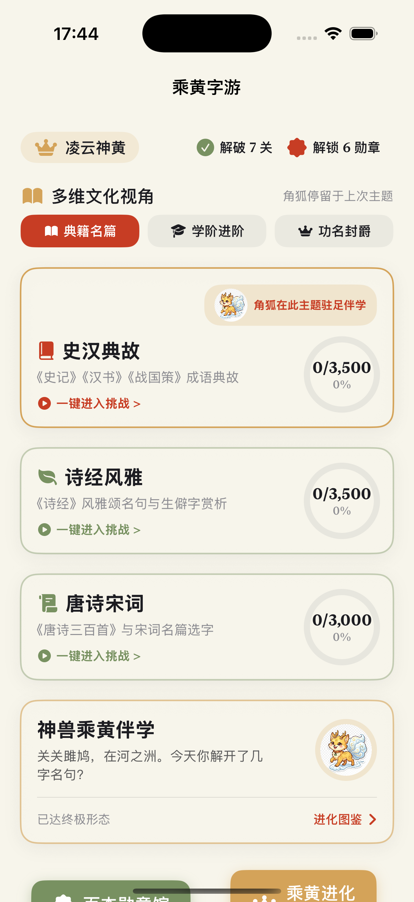
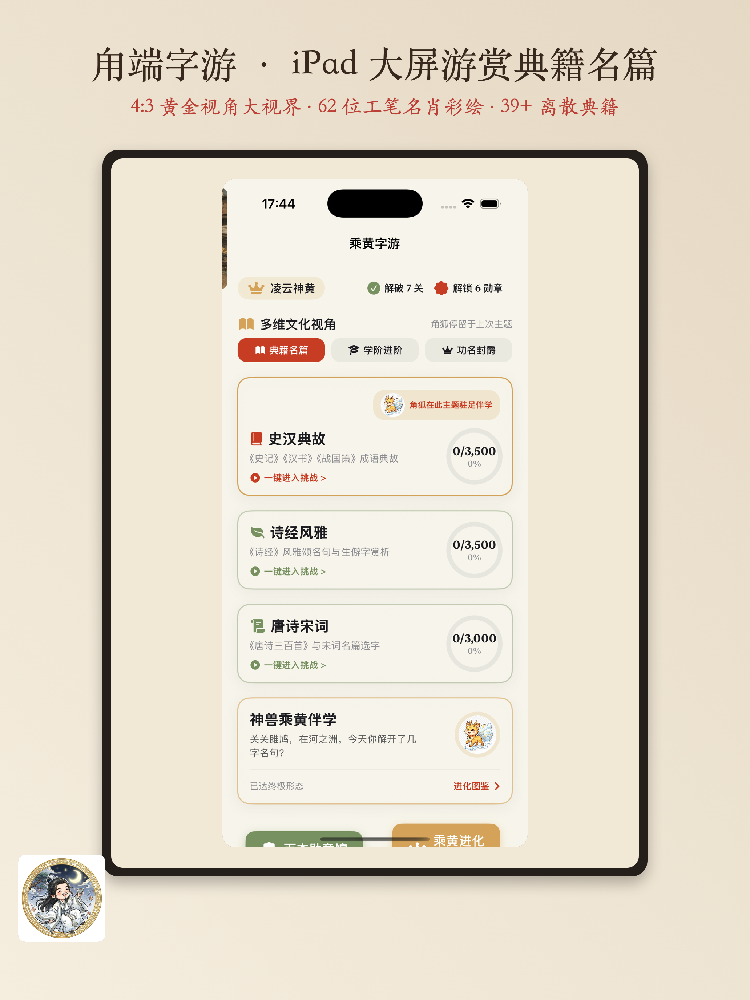

# 文绉绉·甪端 (luDuan) — 中国传统典籍语音拼字与名肖游赏

> **版本**：v1.2.0 (Build 12) · iOS 17.0+ · SwiftUI · 已上架 App Store

<p align="center">
  
  &nbsp; &nbsp;
  
</p>

---

## 🌟 核心特色与产品亮点

《文绉绉·甪端》（原名《甪端字游》）是一款融合**中国传统典籍美学、工笔重彩彩绘与智能语音交互**的古风汉字成语诗词拼字闯关应用。

### 1. 📖 离散典籍库与万关生成
- **43 个离散典籍 JSON 种子库**：收录《诗经》《史记》《道德经》《周易》《尚书》《三国志》《战国策》《后汉书》及唐诗宋词等全量典籍名篇。
- **10,000+ 动态关卡**：基于独立种子词库与拼音校核，程序化生成富有挑战的矩阵拼字关卡。

### 2. 🎨 全量 166 枚勋章图鉴
- **人物名将 62 枚**：覆盖王阳明、司马迁、庄子、范仲淹、老子、孙武、陶渊明、陆游、王安石、司马光、李白、苏轼等全量历史名人工笔重彩肖像。
- **功名学阶 23 枚**：童生·秀才·举人·进士·翰林·首辅六大层次，匹配明代官服卡通形象。
- **典籍名篇 41 枚**：每部典籍对应一枚专属书面印章。
- **处世修养 40 枚**：修身立德、齐家修业等八大主题。

### 3. 🎙️ 智能语音拼字与防抖选字
- 内置 0.3 秒防抖控制（`DispatchWorkItem`），支持自然口述语音识别。
- 支持真机麦克风输入与模拟器 Mock 双重兼容，语音吐字平滑流畅。
- 语音乱序容错：识别出字集合与目标一致时，自动按正确顺序选入。

### 4. 📜 功名学阶与全域词汇同步
- 独立统计从**童生、秀才、贡生、举人**到**宰辅、帝师**的科举学阶递进。
- 跨主题同词全域自动同步与"全新开发"重玩模式。

---

## 🛠️ 技术架构与栈说明

```
文绉绉·甪端 (luDuan)
├── Sources/
│   ├── app/                    # App 入口（LuduanApp.swift）
│   └── core/
│       ├── Components/         # 通用 UI 组件（烟花、分享海报、QR码）
│       ├── Data/
│       │   ├── Models/         # LevelModel、BadgeModel、PetModel、UserProgressModel
│       │   ├── Preset/         # PresetData（badges.json 预设加载）
│       │   └── Repository/     # GameDataRepository（四重持久化）
│       ├── DesignSystem/       # 设计令牌（颜色、字体、组件）
│       ├── Features/
│       │   ├── Launch/         # LaunchScreenView
│       │   ├── Dashboard/      # MainDashboardView
│       │   ├── PuzzleGame/     # PuzzleGameView / StoryCardModalView / MilestoneCelebrationModalView
│       │   ├── BadgeGallery/   # BadgeGalleryView
│       │   └── LevelSelection/ # 关卡选择视图
│       ├── GameEngine/
│       │   ├── PuzzleEngine.swift            # 答题逻辑引擎
│       │   ├── Classic10000LevelsEngine.swift # 万关程序化生成引擎
│       │   ├── PinyinHelper.swift             # 拼音降级匹配
│       │   └── SoundManager.swift             # 音效系统
│       ├── Intents/            # Siri Shortcuts / Widget Intent
│       ├── Resources/          # JSON 种子库（43 个典籍 + words.json）
│       └── Utils/              # 工具类（KeychainStore、ShareSheetHelper 等）
└── Tests/                      # XCTest 单元测试（76+ 测试用例）
```

**核心技术栈：**
- **UI 框架**：SwiftUI + Combine
- **音频与语音**：AVFoundation (`AVAudioEngine`) + Speech (`SFSpeechRecognizer`)
- **持久化（四重）**：App Group UserDefaults + Keychain + Standard UserDefaults + Documents 文件
- **工程构建**：XcodeGen (`project.yml`)
- **质量保证**：XCTest 自动化单元测试，76+ 测试用例 100% 绿色通过

---

## 📦 数据架构

| 数据 | 存储 | 说明 |
|---|---|---|
| 勋章目录 | `badges.json`（166 枚） | 代码仅 JSON 解码，增删改数据只动 JSON |
| 关卡种子 | 43 个 JSON 文件（懒加载缓存） | 万关程序化生成 |
| 词汇总库 | `words.json` + `badge_word_map.json` | 词条与勋章关联映射 |
| 勋章图 | `BadgeImages/` 目录 | 人物真实画像 / 学阶明代官服 / 典籍书面 |
| 用户进度 | `learnedPhrases` + `unlockedBadgeIds` | 四重加密持久化 |

---

## 🚀 编译与运行指南

### 1. 刷新工程
```bash
cd ios && xcodegen generate
```

### 2. 运行单元测试
```bash
cd ios && swift test
```

### 3. App Store IPA 打包与导出
```bash
# 1. 归档 Archive
xcodebuild archive \
  -project luDuan.xcodeproj \
  -scheme luDuan \
  -configuration Release \
  -destination 'generic/platform=iOS' \
  -archivePath build/luDuan.xcarchive

# 2. 导出 IPA 包（可直接拖入 Transporter 交付）
xcodebuild -exportArchive \
  -archivePath build/luDuan.xcarchive \
  -exportOptionsPlist ExportOptions.plist \
  -exportPath build/ipa \
  -allowProvisioningUpdates
```

---

## 📋 版本历史

| 版本 | Build | 主要变更 |
|---|---|---|
| v1.2.0 | 12 | 品牌更名为"文绉绉·甪端"，勋章系统扩充至 166 枚，文档全面刷新 |
| v1.0.1 | 10 | 修复 iOS 17.5 兼容问题，优化语音识别防抖 |
| v1.0.0 | 8 | 首次提交 App Store 审核，39+ 典籍，62 位工笔肖像上线 |

---

## 📸 App Store 官方宣发功能图

工程中已生成用于 App Store Connect 上传的高清功能宣传大图：
- **iPhone 宣发海报**：`docs/screenshot_iphone.png` (`1242 × 2688`)
- **iPad 宣发海报**：`docs/appstore_screenshot_ipad.png` (`2064 × 2752`)
